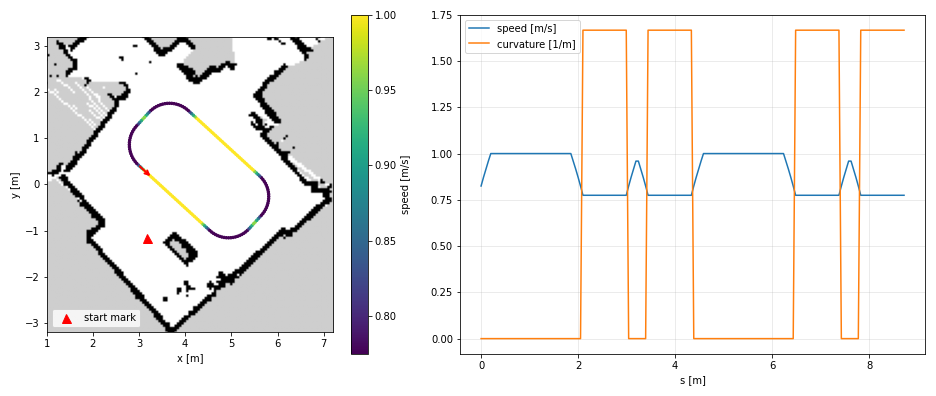

# Racing line

`scripts/make_track.py` on `maps/room`: the largest rectangle with 0.6 m rounded corners that
stays 0.5 m from every occupied or unknown cell, driven counterclockwise (left turns, the side
where the steering map was measured in motion). Speed from the curvature,
v = min(1.0, sqrt(1.0 / |k|)) m/s, then 0.8 m/s² for speeding up and braking.
Output `maps/room_track.csv`: s, x, y, yaw, kappa, v every 5 cm.

## Numbers

3.3 x 1.6 m at -42.5 deg, center (4.30, 0.30): 8.77 m, two 2.1 m straights, four 90 deg
corners at R 0.6 m (twice the car's minimum, 0.31 m). Clearance 0.51 m.
Speed 0.77 m/s in the corners, 1.0 on the straights, 10.1 s a lap. The lateral limit,
1.0 m/s², is 37% of the rear sliding friction (0.276 g): no drift in the baseline.

The contour of the free space itself, smoothed with splines or Fourier harmonics, kept
corners under 0.3 m radius from the recesses of the room and the gap by the table.
